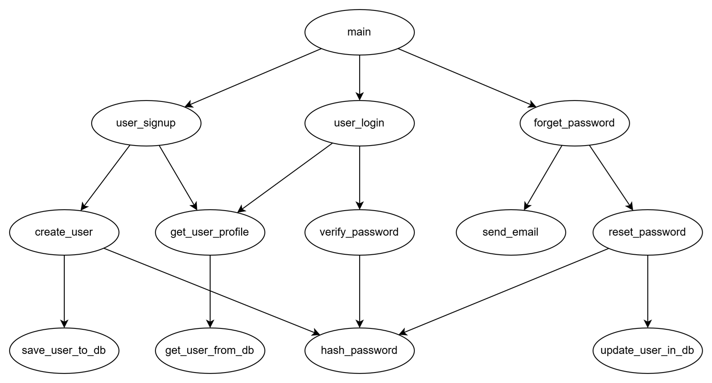

# User account management

## Function decomposition
User account management includes 3 major functions: user signup, login and forget password. To implement functionalities, following decomposed functions are designed.
- create_user: Use user input parameters (Full name, DOB, email, password...) to create a user and save to database. Check user existance before creation.
- get_user_profile: Get user information from database.
- verify_password: check password correctness via hash comparison.
- send_email: send email to user with password reset URL linkage.
- reset_password: update user password in database.
- hash_password: Turn a plain password into a hash to ensure security.
- save_user_to_db, get_user_from_db, update_user_in_db: Database action functions.

