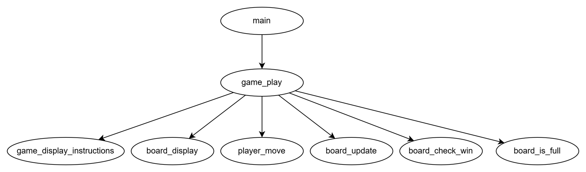

# Object-Oriented CLI Tic-Tac-Toe

Classic Tic-Tac-Toe game built in Python using Object-Oriented Programming (OOP) principles.

---

## 🛠️ Architecture Overview

The system architecture separates data structure, data presentation, and runtime flow control:

* **`Board`**: Manages the 3x3 grid state, cell updates, visual rendering, and evaluates win/tie conditions.
* **`Player`**: Encapsulates player identities (`X` or `O`) and captures user input logic.
* **`TicTacToeGame`**: Serves as the central controller orchestrating the game loop, player switching, and state evaluations.

---

## 📦 Installation & Setup

### Prerequisites
* Python 3.6 or higher installed on your system.

### Running the Game
1. Clone or download this repository to your local machine.
2. Open your terminal or command prompt, navigate to the project directory, and execute:

```bash
python src/main.py
```

## Functional decomposition

