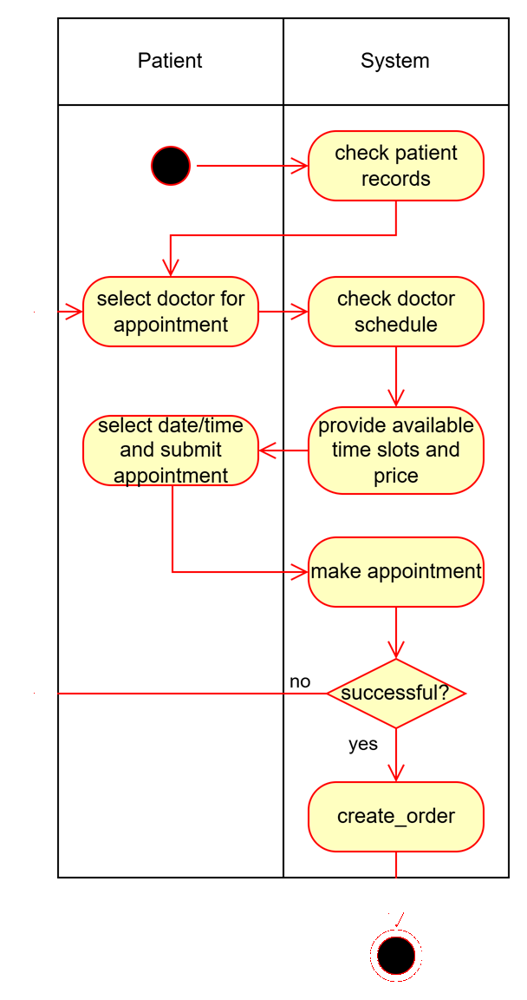
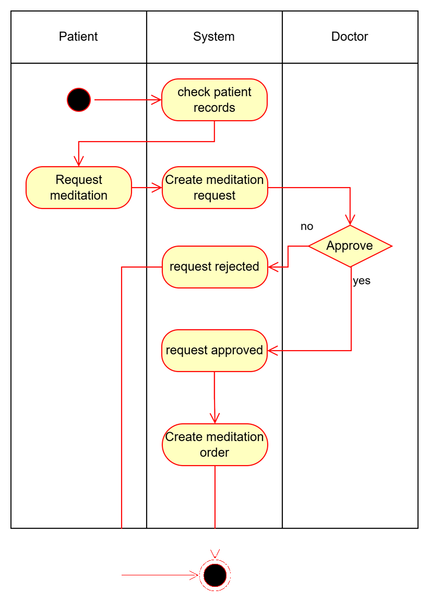
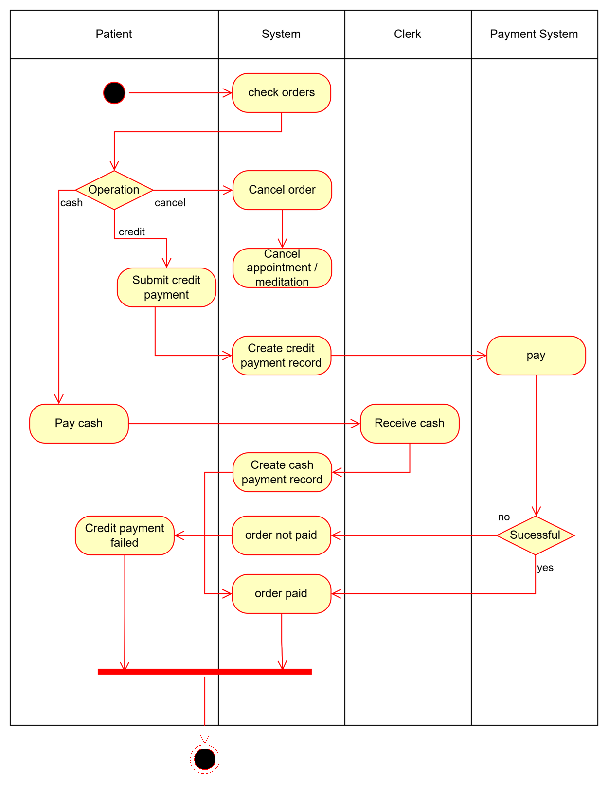

# Clinic activity diagrams
There are 3 diagrams provided
- Appointment diagram shows the workflow between the patient and the system. On sucess, an appointment and its corresponding order will be created in the system.

- Meditation diagram shows the workflow among the patient, the doctor and the systme. On sucess, a meditation request and its corresponding order will be created in the system.

- Payment diagram shows the workflow among the patient, the clerk, the bank system and the clinic system. It handles the order and corresponding appointment/meditation accordingly and generate associated payment record.

