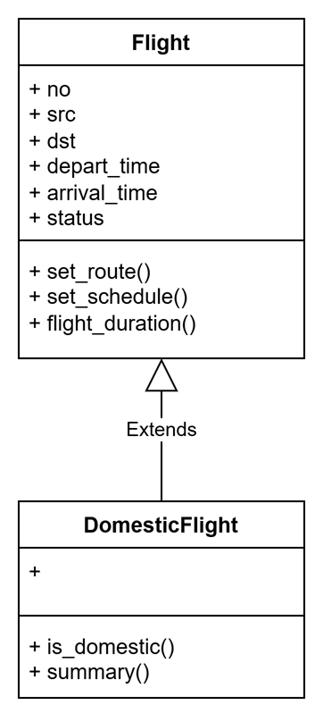

# Flight Module

This directory contains a simple flight module for domestic travel.

## Files

- `flight.py` - defines `GeneralFlight` and `DomesticFlight` classes with domestic-flight-specific attributes and methods.
- `flight.png` - a linked image that illustrates the flight design.

## Image

