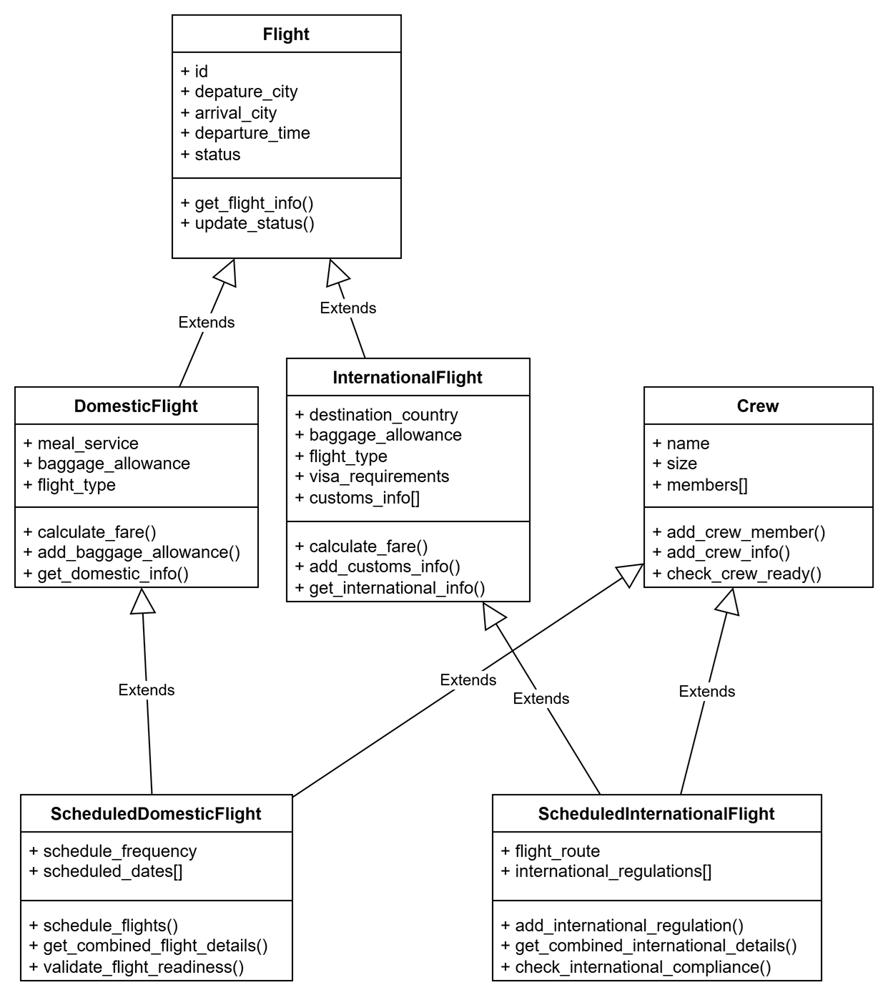

# Flight Inheritance Demo

This project demonstrates inheritance concepts in Python using flight classes.

## Overview

- `flight.py` contains classes that model flights, crew, and scheduled flight systems.
- The code demonstrates:
  - single inheritance (`DomesticFlight`, `InternationalFlight`)
  - multiple inheritance (`ScheduledDomesticFlight`, `ScheduledInternationalFlight`)
  - multilevel inheritance and hybrid inheritance

## Key Classes

- `Flight`
  - Base class for flight details and status management.
- `Crew`
  - Mixin class for crew management and readiness checks.
- `DomesticFlight`
  - Inherits from `Flight` and adds domestic-specific behavior.
- `InternationalFlight`
  - Inherits from `Flight` and adds international-specific behavior.
- `ScheduledDomesticFlight`
  - Inherits from `DomesticFlight` and `Crew`, showing hybrid inheritance.
- `ScheduledInternationalFlight`
  - Inherits from `InternationalFlight` and `Crew`, showing hybrid inheritance.

## Run the Project

Execute the script with Python:

```bash
python flight.py
```

This will create sample domestic, international, and scheduled flights, then print details and status updates.

## Class Diagram

The class diagram for this project is available as `flight.png`.



## Notes

The `main()` function in `flight.py` demonstrates how the classes work together and how inheritance is used to extend functionality.
